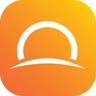
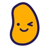

<a href="https://noman-ahmad.github.io">
  <picture>
    <source media="(prefers-color-scheme: dark)" srcset="assets/banner-dark.svg">
    
  </picture>
</a>

  
  
  
  

## Hey, I'm Noman 👋

I build mobile products in **React Native** and **native iOS**, from 0-to-1 App Store launches to apps serving **400K+ users**.

Right now I'm a Senior Mobile Software Engineer at **[Club](https://club.com)**. I took our app from a bare shell to a public iOS and Android launch in three months, and I'm now rebuilding it natively in **Swift and SwiftUI**. I'm comfortable following a feature from the UI down into the backend when that's what shipping takes.

<table>
  <tr>
    <td align="center"><h3>4+ years</h3>shipping mobile to production</td>
    <td align="center"><h3>400K+</h3>users on apps I've built</td>
  </tr>
  <tr>
    <td align="center"><h3>4.8 ★</h3>App Store rating for Club</td>
    <td align="center"><h3>3 months</h3>from bare shell to public launch</td>
  </tr>
</table>

## Where I've shipped

<table>
  <tr>
    <td width="64" align="center"></td>
    <td>
      <b>Senior Mobile Software Engineer</b> · <a href="https://club.com">Club</a> · <a href="https://apps.apple.com/us/app/club-com/id6774236682">App Store</a> 
      May 2026 – present 
      Took the React Native app from a bare shell to public iOS and Android launch in three months (30K+ new users, 4.8★), then built the native Swift and SwiftUI rewrite that holds the feed under 200 MB where the old app climbed to 2–3 GB.
    </td>
  </tr>
  <tr>
    <td align="center"></td>
    <td>
      <b>Senior Software Engineer, Enterprise Integrations</b> · <a href="https://www.nttdata.com">NTT Data</a> 
      Jun 2025 – May 2026 
      Built a headless UI automation framework with Playwright, engineered an Amazon RDS to Salesforce pipeline that moves thousands of records every night, and mentored five junior developers.
    </td>
  </tr>
  <tr>
    <td align="center"></td>
    <td>
      <b>Software Engineer II, Full Stack</b> · <a href="https://www.sunnova.com">Sunnova Energy</a> · <a href="https://apps.apple.com/us/app/sunnova/id1604631393">App Store</a> 
      Apr 2022 – May 2025 
      An offline-first rewrite cut API calls by 43% for 400K+ users. Shipped Apple Pay and Google Pay ($250K+ a month) and push notifications (55K+ a month), and rebuilt auth for 1M+ daily requests at 99.9% uptime.
    </td>
  </tr>
  <tr>
    <td align="center"></td>
    <td>
      <b>iOS Software Engineering Intern</b> · Potato TV 
      Jan – Apr 2022 
      My first production iOS work: a native share modal in SwiftUI, plus fixes for crashes caused by deprecated APIs across Xcode and SwiftUI upgrades.
    </td>
  </tr>
  <tr>
    <td align="center"></td>
    <td>
      <b>B.S. Computer Science, Mathematics minor</b> · <a href="https://www.hunter.cuny.edu">CUNY Hunter College</a> 
      2021 · Dean's List, Cum Laude 
      Spent two years as a teaching assistant for data structures, algorithms and intro programming.
    </td>
  </tr>
</table>

## Toolbox

<table>
  <tr>
    <td><b>Mobile</b></td>
    <td>
      <picture>
        <source media="(prefers-color-scheme: dark)" srcset="https://skillicons.dev/icons?i=swift%2Creact%2Credux%2Csqlite%2Capple%2Candroidstudio&theme=dark">
        
      </picture>
    </td>
  </tr>
  <tr>
    <td><b>Languages</b></td>
    <td>
      <picture>
        <source media="(prefers-color-scheme: dark)" srcset="https://skillicons.dev/icons?i=ts%2Cjs%2Cpy%2Ccs%2Ccpp&theme=dark">
        
      </picture>
    </td>
  </tr>
  <tr>
    <td><b>Backend &amp; web</b></td>
    <td>
      <picture>
        <source media="(prefers-color-scheme: dark)" srcset="https://skillicons.dev/icons?i=nodejs%2Cnextjs%2Cdotnet%2Cfastapi%2Cpostgres&theme=dark">
        
      </picture>
    </td>
  </tr>
  <tr>
    <td><b>Cloud &amp; quality</b></td>
    <td>
      <picture>
        <source media="(prefers-color-scheme: dark)" srcset="https://skillicons.dev/icons?i=aws%2Cterraform%2Cdocker%2Cgithubactions%2Cjest%2Csentry&theme=dark">
        
      </picture>
    </td>
  </tr>
</table>

## Let's build something

Always up for talking mobile architecture, app performance, or a product worth shipping. The fastest way to reach me is email at **[nomanahmad.dev@gmail.com](mailto:nomanahmad.dev@gmail.com)**. I read everything.
